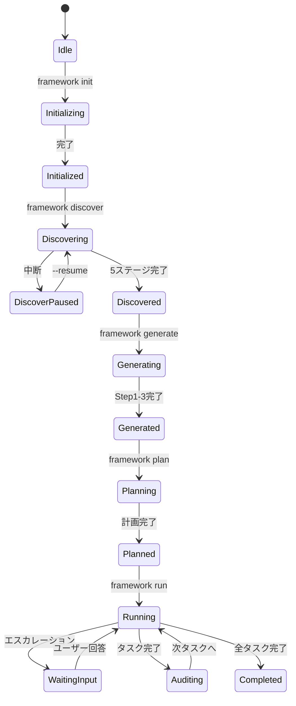
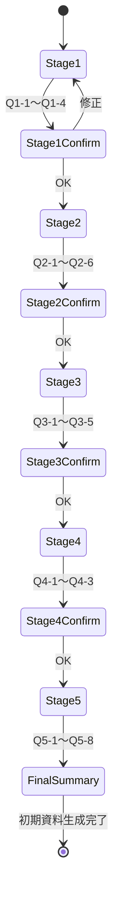

# SSOT-2: 画面・状態遷移定義

> AI Development Platform の画面構成と状態遷移

---

## 基本情報

| 項目 | 内容 |
|------|------|
| プロダクト名 | AI Development Platform |
| バージョン | v0.1.0 |
| 最終更新日 | 2026-02-02 |
| ステータス | Approved |

---

## 1. 画面一覧（CLI）

| ID | 画面名 | コマンド | 説明 |
|----|--------|---------|------|
| SCR-001 | Init画面 | `framework init` | プロジェクト初期化ウィザード |
| SCR-002 | Discover画面 | `framework discover` | 5ステージ対話型ヒアリング |
| SCR-003 | Generate画面 | `framework generate` | SSOT生成チェーン進捗表示 |
| SCR-004 | Plan画面 | `framework plan` | 実装計画・タスク分解結果表示 |
| SCR-005 | Run画面 | `framework run` | 自動開発実行・確認フロー |
| SCR-006 | Audit画面 | `framework audit` | 監査結果・スコア表示 |
| SCR-007 | Status画面 | `framework status` | 進捗ダッシュボード |

---

## 2. CLI状態遷移



---

## 3. Discoverフロー状態



---

## 4. 共通UIパターン（CLI）

### 4.1 プログレスバー

```
[Step 1/3] ビジネス資料生成中...
  ├── IDEA_CANVAS.md      ████████░░ 80%
  ├── USER_PERSONA.md     █████░░░░░ 50%
  └── VALUE_PROP.md        █████░░░░░ 50%
```

### 4.2 監査スコア表示

```
━━━ Audit Report ━━━━━━━━━━━━━━━
Score: 97/100 [PASS]
  完全性    15/15  ████████████████
  一貫性    14/15  ██████████████░░
  ...
```

### 4.3 エスカレーション表示

```
⚠ 確認が必要です [T2: 仕様曖昧]
  質問: エラーレスポンス形式をどちらにしますか？
  [1] RFC 7807（推奨）
  [2] カスタム形式
  回答 (1/2):
```

---

## 5. ダッシュボード画面一覧（Phase 3）

| ID | パス | 画面名 |
|----|------|--------|
| DASH-001 | / | ホーム（進捗サマリー） |
| DASH-002 | /projects | プロジェクト一覧 |
| DASH-003 | /projects/[id] | プロジェクト詳細 |
| DASH-004 | /projects/[id]/audit | 監査結果 |
| DASH-005 | /projects/[id]/tasks | タスク一覧 |

---

## 変更履歴

| 日付 | バージョン | 変更内容 | 変更者 |
|------|----------|---------|-------|
| 2026-02-02 | v0.1.0 | 初版作成 | AI |
