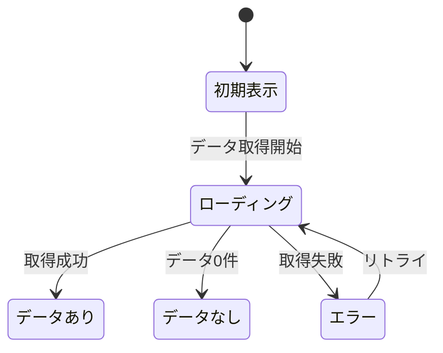

# 12_SSOT_FORMAT.md - SSOT フォーマット定義

> IEEE/ISO/IEC 29148:2018 + RFC 2119 準拠の機能仕様書フォーマット

---

## 準拠規格

| 規格 | 適用範囲 |
|------|---------|
| ISO/IEC/IEEE 29148:2018 | 要件エンジニアリング全体の構造 |
| IEEE 830 (SRS) | ソフトウェア要求仕様の記述方法 |
| RFC 2119 | 要求レベル定義（MUST / SHOULD / MAY） |
| ISO/IEC 25010:2011 | ソフトウェア品質特性（非機能要件） |
| OpenAPI 3.0 | API仕様の記述形式 |

---

## RFC 2119 要求レベル定義

```
MUST（必須）:
  この要件は絶対に満たさなければならない。
  満たさない場合、機能は未完成とみなす。

SHOULD（推奨）:
  この要件は満たすことが強く推奨される。
  正当な理由がある場合に限り省略可能。
  省略する場合は理由をADRに記録する。

MAY（任意）:
  この要件は実装してもしなくてもよい。
  実装する場合はこの仕様に従う。

MUST NOT（禁止）:
  この動作は絶対に許可してはならない。

SHOULD NOT（非推奨）:
  この動作は正当な理由がない限り避けるべき。
```

---

## SSOT テンプレート

```markdown
# [機能ID] [機能名] - 機能仕様書（SSOT）

> バージョン: 1.0
> ステータス: Draft / Review / Approved
> 最終更新: YYYY-MM-DD
> 作成者: [名前]
> 承認者: [名前]
> 親タスク: [PT-XXX]

---

## §1 文書情報

| 項目 | 内容 |
|------|------|
| 機能ID | [例: FEAT-001] |
| 機能名 | [例: AI画像分析] |
| ジャンル | [例: 画像分析フロー] |
| 親タスク | [例: PT-001] |
| 優先度 | P0 / P1 / P2 |
| 種別 | 個別機能 |
| 担当 | |
| 推定規模 | S / M / L / XL |

### 変更履歴

| バージョン | 日付 | 変更内容 | 変更者 |
|-----------|------|---------|-------|
| 1.0 | | 初版作成 | |

### 関連ドキュメント

| ドキュメント | 関係 |
|-------------|------|
| SSOT-0_PRD.md §X.X | 要件の根拠 |
| SSOT-1 [機能ID] | 機能カタログの該当行 |
| [関連機能ID] | 依存/連携 |

---

## §2 機能概要

### 2.1 目的
[この機能が存在する理由を1-2文で]

### 2.2 スコープ

#### 含まれるもの
- [MVP で実装する機能・操作]
- [MVP で実装する機能・操作]

#### 含まれないもの（明示的除外）
- [今回実装しないもの]
- [将来検討するもの]

### 2.3 ユーザーストーリー

```
[ペルソナ名] として、
[操作/機能] したい。
なぜなら [達成したい目的] だから。

受け入れ基準:
- [基準1]
- [基準2]
- [基準3]
```

### 2.4 ユーザーフロー

```
1. [ユーザーの操作ステップ1]
2. [ユーザーの操作ステップ2]
3. [システムの応答]
4. [ユーザーの操作ステップ3]
5. [最終結果]
```

---

## §3 機能要件

### RFC 2119 準拠の要件リスト

| 要件ID | レベル | 要件 | 検証方法 |
|--------|--------|------|---------|
| FR-001 | MUST | [要件の記述] | [テスト方法] |
| FR-002 | MUST | [要件の記述] | [テスト方法] |
| FR-003 | SHOULD | [要件の記述] | [テスト方法] |
| FR-004 | MAY | [要件の記述] | [テスト方法] |
| FR-005 | MUST NOT | [禁止事項] | [テスト方法] |

### 要件の詳細

#### FR-001: [要件名]
- **レベル**: MUST
- **説明**: [詳細な説明]
- **根拠**: PRD §X.X / ユーザーヒアリング
- **条件**: [前提条件があれば]
- **検証**: [どうテストするか]

---

## §4 データ仕様

### 4.1 データ項目一覧

| # | 項目名 | 物理名 | 型 | 必須 | デフォルト | バリデーション | 備考 |
|---|--------|--------|-----|------|----------|--------------|------|
| 1 | | | | | | | |
| 2 | | | | | | | |

### 4.2 バリデーションルール

| 項目 | ルール | エラーメッセージ |
|------|-------|----------------|
| | | |

### 4.3 データライフサイクル

```
作成: [いつ、どのように作成されるか]
更新: [いつ、どのように更新されるか]
削除: [削除方式: 物理削除/論理削除/アーカイブ]
保持期間: [いつまで保持するか]
```

---

## §5 API 仕様

### 5.1 エンドポイント一覧

| メソッド | パス | 説明 | 認証 |
|---------|------|------|------|
| POST | /api/v1/xxx | | Required |
| GET | /api/v1/xxx/:id | | Required |

### 5.2 エンドポイント詳細

#### POST /api/v1/xxx

**リクエスト:**
```typescript
interface CreateXxxRequest {
  field1: string;    // [説明]
  field2?: number;   // [説明] (optional)
}
```

**レスポンス（成功: 201）:**
```typescript
interface CreateXxxResponse {
  data: {
    id: string;
    field1: string;
    createdAt: string;
  };
}
```

**レスポンス（エラー）:**
| ステータス | コード | 条件 |
|-----------|--------|------|
| 400 | VALIDATION_ERROR | バリデーション失敗 |
| 401 | UNAUTHORIZED | 未認証 |
| 403 | FORBIDDEN | 権限不足 |
| 409 | CONFLICT | 重複 |
| 500 | INTERNAL_ERROR | サーバーエラー |

---

## §6 UI 仕様

### 6.1 画面一覧

| 画面ID | 画面名 | パス | 認証 |
|--------|--------|------|------|
| | | | |

### 6.2 画面レイアウト

```
[テキストベースのワイヤーフレーム]

┌─────────────────────────────────┐
│ ヘッダー                        │
├─────────────────────────────────┤
│                                 │
│  [主要コンテンツ]               │
│                                 │
├─────────────────────────────────┤
│ フッター / アクションバー       │
└─────────────────────────────────┘
```

### 6.3 状態一覧

| 状態 | 条件 | 表示内容 |
|------|------|---------|
| 初期表示 | | |
| ローディング | | |
| データあり | | |
| データなし（空状態） | | |
| エラー | | |

### 6.4 状態遷移図



### 6.5 操作フロー

| # | ユーザー操作 | システム応答 | 遷移先 |
|---|------------|------------|-------|
| 1 | | | |
| 2 | | | |

---

## §7 ビジネスルール

### 7.1 ルール一覧

| ルールID | ルール名 | 条件 | アクション | レベル |
|---------|---------|------|----------|--------|
| BR-001 | | IF [条件] | THEN [動作] | MUST |
| BR-002 | | IF [条件] | THEN [動作] | SHOULD |

### 7.2 ルール詳細

#### BR-001: [ルール名]
- **条件**: [いつ適用されるか]
- **ロジック**: [具体的な処理]
- **例外**: [例外ケース]
- **根拠**: [なぜこのルールか]

---

## §8 非機能要件（ISO 25010 準拠）

### 8.1 性能
| 指標 | 目標値 | 測定方法 |
|------|-------|---------|
| 応答時間 | [例: 3秒以内] | API レスポンスタイム |
| スループット | [例: 100 req/s] | 負荷テスト |
| データ量 | [例: 10万件まで] | 機能テスト |

### 8.2 セキュリティ
| 要件 | レベル | 対策 |
|------|--------|------|
| 認証 | MUST | [方式] |
| 認可 | MUST | [方式] |
| データ暗号化 | SHOULD | [方式] |
| 入力サニタイズ | MUST | [方式] |

### 8.3 可用性
| 要件 | 目標 |
|------|------|
| 稼働率 | [例: 99.9%] |
| 障害復旧時間 | [例: 1時間以内] |
| データバックアップ | [例: 日次] |

### 8.4 保守性
| 要件 | 対策 |
|------|------|
| ログ出力 | [レベルと内容] |
| モニタリング | [監視項目] |
| デプロイ | [手順] |

---

## §9 エラーハンドリング

### 9.1 エラーケース一覧

| # | エラー条件 | 種別 | ユーザーメッセージ | システム動作 | 復旧方法 |
|---|----------|------|-----------------|------------|---------|
| 1 | | 入力エラー | | | |
| 2 | | 認証エラー | | | |
| 3 | | 外部API障害 | | | |
| 4 | | タイムアウト | | | |

### 9.2 エラー時のフォールバック

```
外部サービス障害時:
  1. [リトライ回数]回リトライ
  2. [フォールバック動作]
  3. ユーザーに[メッセージ]を表示
  4. エラーログを[レベル]で出力
```

---

## §10 テストケース

### 10.1 正常系

| TC-ID | テスト名 | 前提条件 | 操作 | 期待結果 | 優先度 |
|-------|---------|---------|------|---------|--------|
| TC-N-001 | | | | | P0 |
| TC-N-002 | | | | | P0 |

### 10.2 異常系

| TC-ID | テスト名 | 前提条件 | 操作 | 期待結果 | 優先度 |
|-------|---------|---------|------|---------|--------|
| TC-E-001 | | | | | P0 |
| TC-E-002 | | | | | P0 |

### 10.3 境界値

| TC-ID | テスト名 | 入力値 | 期待結果 |
|-------|---------|--------|---------|
| TC-B-001 | | 最小値 | |
| TC-B-002 | | 最大値 | |
| TC-B-003 | | 空 | |

### 10.4 テストカバレッジ

```
MUST要件: 全てテストケースが存在すること
SHOULD要件: 主要なケースのテストが存在すること
MAY要件: テスト任意
```

---

## §11 依存関係・影響範囲

### 11.1 依存する機能

| 依存先 | 依存内容 | 影響度 |
|--------|---------|--------|
| [機能ID] | [何を使うか] | 高/中/低 |

### 11.2 依存される機能

| 依存元 | 依存内容 | 影響度 |
|--------|---------|--------|
| [機能ID] | [何が使われるか] | 高/中/低 |

### 11.3 外部サービス依存

| サービス | 用途 | 障害時の影響 | フォールバック |
|---------|------|------------|--------------|
| | | | |

---

## §12 未決定事項・制約

### 12.1 未決定事項（TBD）

| # | 項目 | 理由 | 期限 | 影響範囲 |
|---|------|------|------|---------|
| | | | | |

**注意: 監査合格にはTBD項目がゼロであること**

### 12.2 前提条件

- [前提1]
- [前提2]

### 12.3 制約事項

- [制約1]
- [制約2]

---

## 監査情報

| 項目 | 内容 |
|------|------|
| 監査日 | |
| 監査スコア | /100 |
| 合格判定 | 合格 / 条件付き合格 / 不合格 |
| 指摘事項数 | Critical: / Major: / Minor: |
| 監査詳細 | 13_SSOT_AUDIT.md 参照 |
```

---

## 変更履歴

| 日付 | 変更内容 | 変更者 |
|------|---------|-------|
| | 初版作成 | |
